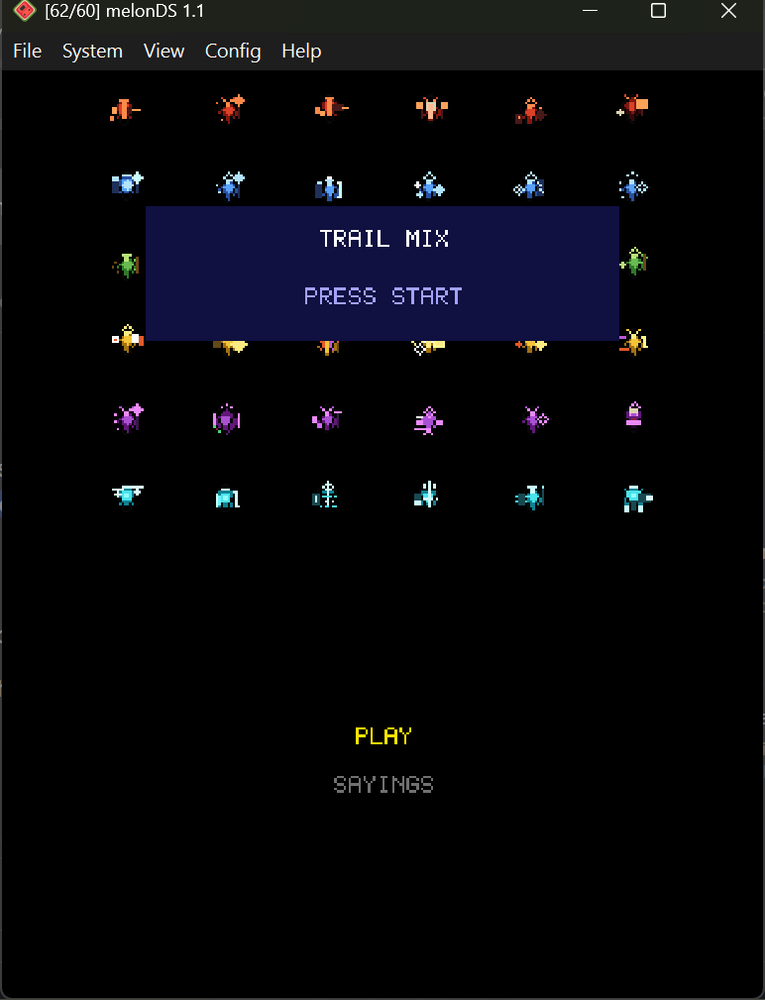
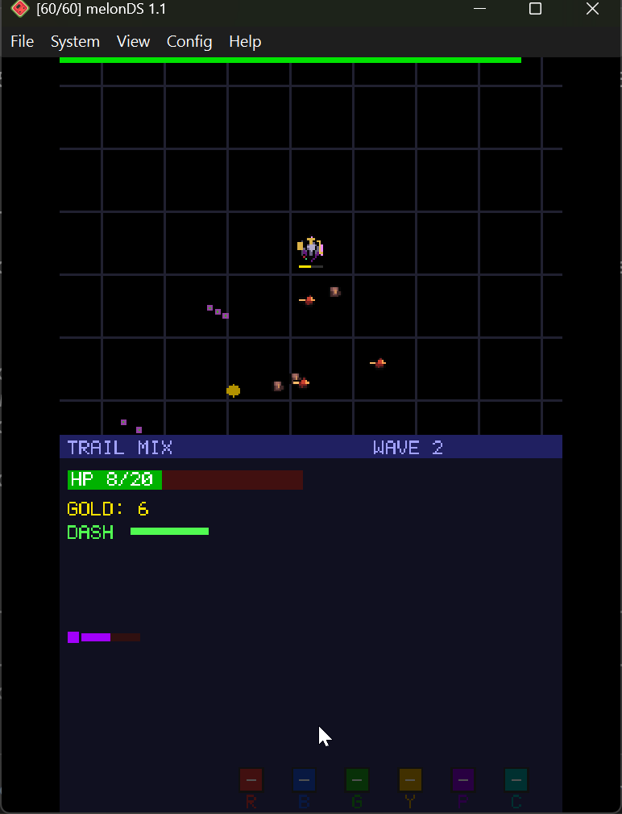
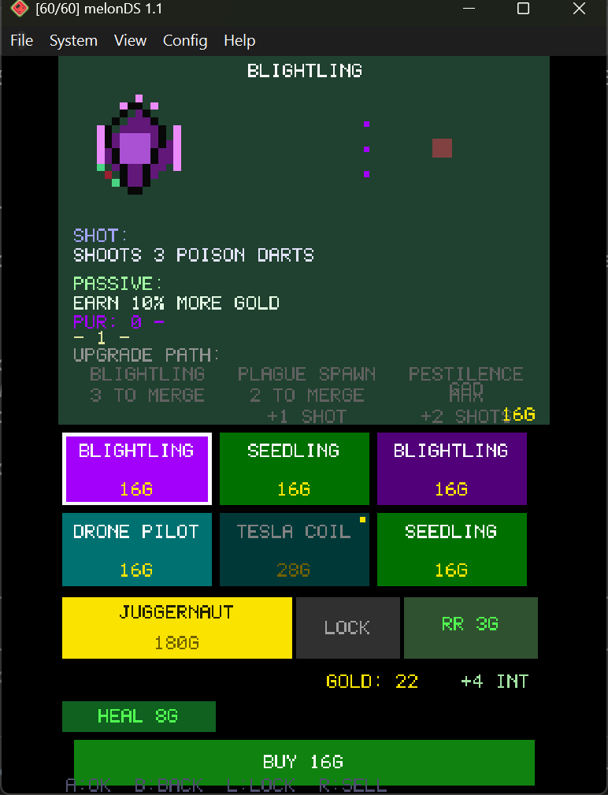
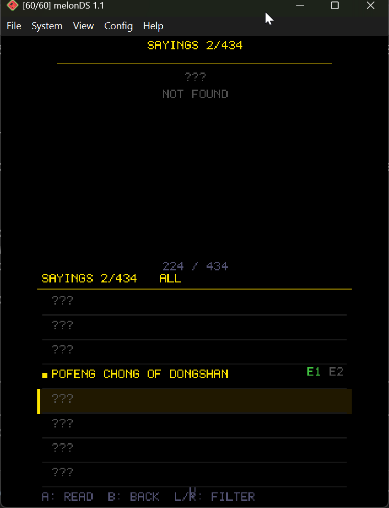

# Trail Mix

A roguelike auto-chess shooter for the Nintendo DS. Collect companions, merge them into stronger versions, and survive 30 waves of increasingly unhinged enemies. Also: there are 434 historical figures hiding in this game, each with up to two encounters translated for the first time into English and German. You'll find them if you play long enough.



## What is this?

You run around a top-down arena dodging enemies while your companions handle the shooting. Between waves you hit the shop, buy new companions, merge duplicates into upgrades, pick perks, and try not to go broke. The whole thing runs on a Nintendo DS.



## Features

**36 companion classes** across 6 color factions (Red, Blue, Green, Yellow, Purple, Cyan), each with 3 upgrade tiers. Every class has a unique shot pattern -- Gunners fire tracer rounds, Tesla Coils chain lightning between targets, Plague Doctors lob poison clouds, Overclockers fire faster until they overheat and burst. Three of the same merge into the next tier.



**30 curated waves** with 5 randomly selected variants per wave, so every run plays different. 17 enemy types in 3 sizes plus 5 bosses with real AI -- the Sentinel orbits and fires spiral bullets, the Dreadnought charges and slams, the Leviathan summons adds. Wave 30 is a 3-phase final boss with phase transitions, minion spawns, and a meltdown mode. Beat it and keep going in endless mode.

**30 perks** from the practical to the absurd. Bullet Hell fires in all 4 directions. Shortcut lets you merge with only 2 copies. Double or Nothing flips a coin on your wave gold. Loan Shark gives you 240g now and bills you 30g per wave for 10 waves. Gold Fever triples all gold for 6 waves.

**6 color synergies** with 4 tiers each. Stack companions of one color for escalating bonuses -- Red burns, Blue freezes, Green heals, Yellow prints money, Purple hexes, Cyan electrifies.

**Economy with interest** -- unspent gold earns interest per wave. Save or spend, your call.

**Sayings Collection** -- after every boss fight, you discover a short encounter from one of 434 historical figures spanning roughly a thousand years. 859 encounters total, most appearing in English (or German) for the first time. They're collected like cards and browsable from the main menu. Finding them all will take a while.



**Full English and German localization.** Every string, every menu, every encounter.

**Runs on real DS hardware.** Tested on R4 flashcart. Saves to SD card.

## Controls

| Input | What it does |
|-------|-------------|
| D-Pad | Move |
| Touch | Move (virtual stick) |
| A/B/X/Y/R | Dash (invincible + damages enemies) |
| L | Slow walk (hold for precision) |

**In the shop:**

| Input | What it does |
|-------|-------------|
| D-Pad | Navigate cards / perk / reroll / start |
| A | Buy / confirm / start wave |
| B | Deselect |
| L | Lock selected card |
| R | Cycle owned companions (to sell) |
| Touch | Everything above, plus heal button |

**Sayings viewer:**

| Input | What it does |
|-------|-------------|
| D-Pad | Scroll through masters |
| A | Read encounter |
| B | Back |
| L/R | Filter (All / Found / Not Found) |

## Building

Needs [devkitPro](https://devkitpro.org/) with the NDS toolchain. Then:

```
make
```

Out comes `trailmix.nds`. Run it on hardware with a flashcart or in [melonDS](https://melonds.kuribo64.net/).

Sprites are pre-converted in `arm9/data/`. To regenerate from source PNGs:

```
python3 tools/png2bin.py
python3 tools/png2bin_enemy.py
```

## Credits

All sound effects from [Kenney.nl](https://kenney.nl) (CC0).
Music from [OpenGameArt.org](https://opengameart.org) (CC0).
Built with devkitARM and libnds.

## License

MIT
